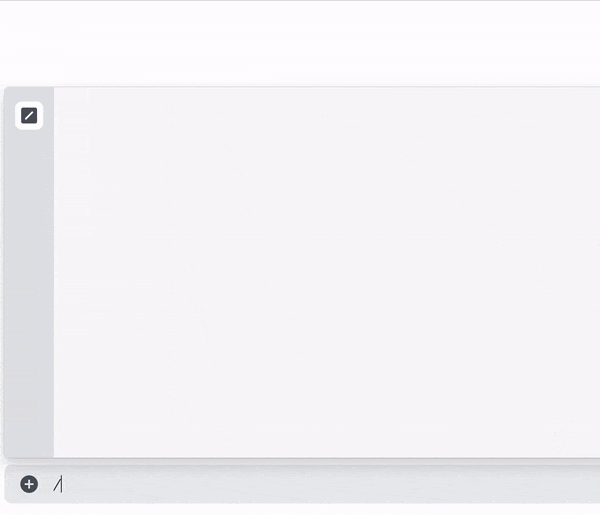

# 🎴 Cardian

Yu-Gi-Oh! Paper, Master Duel and Duel Links Discord Bot

Fetches data from the [YGOPRODeck](https://ygoprodeck.com/) and [Master Duel Meta](https://masterduelmeta.com/) APIs

Get the bot from the new Discord app directory!

[](https://discord.com/application-directory/944183782745997362)

## Features



- Autocompletion
  - Card suggestions with fuzzy searching
- Card info
  - different formats using the `format:` option
  - remembers the last used option as default
- High quality art
- Add card info to messages with `<card name>`s via right click

## Docker container

#### 🚨 The ongoing development made the bot reliant on other services that I host, which makes self hosting not a great option. 

Create a Discord application and get the bot token. ([More info here](https://discord.com/developers/docs/intro))

Run the container with this command:

```sh
docker pull ghcr.io/okkdev/cardian:latest
docker run -e CARDIAN_TOKEN=<your-bot-token> BONK_URL=<bonk-url> okkdev/cardian --name cardian
```

To deploy the application commands run this command once:

```sh
docker exec cardian /app/bin/cardian rpc "Cardian.Interactions.deploy_commands()"
```

#### 🚨 It can take up to 1h to register application commands

#### 🚨 Emotes are currently hardcoded and will probably stop working

### Environment variables

- `BONK_URL`: This is the URL for the [bonk microservice](https://github.com/okkdev/bonk) which returns the whitelist of users that donated on kofi, used for the OCG art command
- `CARDIAN_TOKEN`: Discord bot token
- `CARDIAN_UPDATE_INTERVAL`: Card cache update interval in minutes. Default: 120

## Development

1. Install dependencies:

```sh
mix deps.get
```

2. Set env vars.

3. Run the app:

```sh
mix run --no-halt
# or
iex -S mix
```
