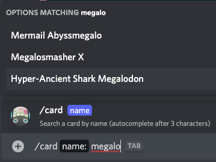
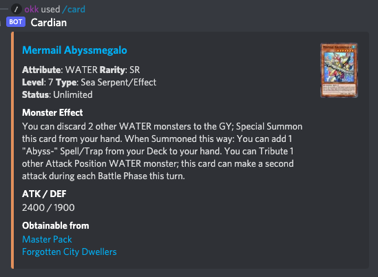

# 🎴 Cardian

Yu-Gi-Oh! Master Duel Discord Bot

Fetches data from the [Master Duel Meta](https://masterduelmeta.com/) API

### [-> Invite Bot <-](https://discord.com/api/oauth2/authorize?client_id=944183782745997362&permissions=3072&scope=applications.commands%20bot)

## Features

### Autocompletion



### Card info



## Run your own Cardian Docker container

Create a Discord application and get the bot token. ([More info here](https://discord.com/developers/docs/intro))

Run the container, from [Docker Hub](https://hub.docker.com/repository/docker/okkdev/cardian), with this command:

```sh
docker run -e CARDIAN_TOKEN=<your-bot-token> okkdev/cardian --name cardian
```

To deploy the application commands run this command once:

```sh
docker exec cardian /app/bin/cardian rpc "Cardian.Interactions.deploy_commands()"
```

#### 🚨 It can take up to 1h to register application commands

### Environment variables

- `CARDIAN_TOKEN`: Discord bot token
- `CARDIAN_UPDATE_INTERVAL`: Card cache update interval in minutes. Default: 120

## Changelog

### 2.0
Refactored how cards are fetched. In v1.0 every autocomplete query and card request were sent to the Master Duel Meta API. This was slow and, especially the autocomplete requests, very wasteful.\
With v2.0 the bot fetches all cards every 2 hours (by default, can be set via env var) and caches them in an ETS. Now all data is fetched from the cache. This is way faster, fixing the time-out of autocompletion responses.

## Development

Install dependencies:

```sh
mix deps.get
```

Run the app:

```sh
mix run --no-halt
```
